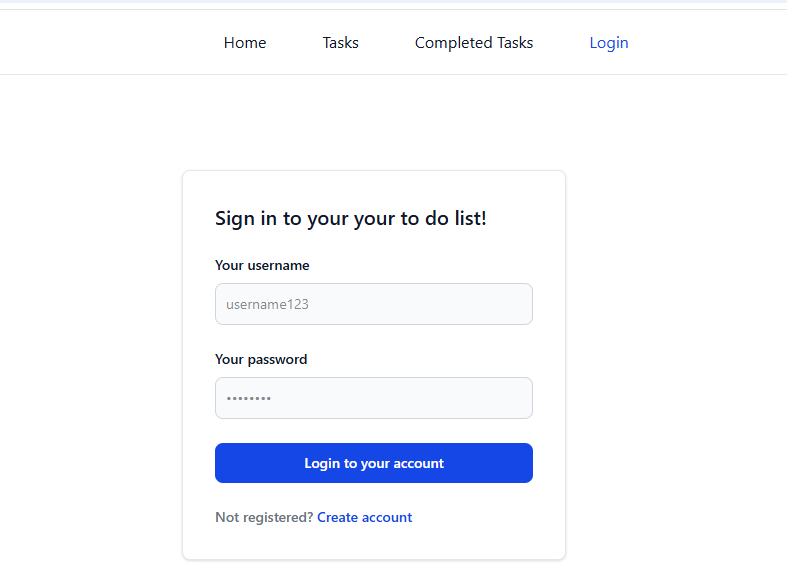

# To-do-App


**ToDoApp** is a full-stack to-do application built with **Django Rest Framework**, **React + Vite**, and **Tailwind CSS**. It helps users keep track of daily and weekly tasks by creating, updating, and marking tasks as completed, all while maintaining a personalized dashboard.

---

## Features

### User Authentication

- Secure login and registration system
- Only logged-in users can access, create, and manage their Tasks
- Each user has private Tasks — no data mixing between users

### Tasks Management

- Create, edit, and delete tasks easily
- Mark tasks as **completed** and access them in an archive

### Responsive Design

Clean and modern UI built with **Tailwind CSS**

Mobile-friendly and intuitive interface

---

## 🛠 Technologies Used

- **Backend:** Django Rest Framework (Python)
- **Frontend:** React+Vite, CSS, Tailwind
- **Database:** SQLite (default with Django)
- **Authentication:** JWT Auth

---

## 💡 User Experience Highlights

- Personalized dashboards for each user

- Tasks are easy to manage and organize

- Smooth interaction between frontend and backend

---

## 📸 Screenshots

### Login Page

  
_Secure login for registered users._

### Registration Page

  
_Easy registration form for new users._

---

## 🚀 Installation & Setup

## Back-end

```bash
# 1. Clone the repository
git clone https://github.com/yourusername/ToDoApp.git
cd .../backend

# 2. Create a virtual environment
python -m venv .venv
source venv/bin/activate   # On Windows: venv\Scripts\activate

# 3. Install dependencies
pip install -r requirements.txt

# 4. Apply migrations
python manage.py migrate

# 5. (Optional) Create a superuser for admin access
python manage.py createsuperuser

# 6. Start the backend server
python manage.py runserver

```

## Front-end

```bash
cd ../frontend

# 1. Install dependencies
npm install

# 2. Set up environment variables
# Create a .env file in the frontend folder
# Example:
# VITE_API_URL=http://127.0.0.1:8000/api

# 3. Run the frontend server
npm run dev
```
